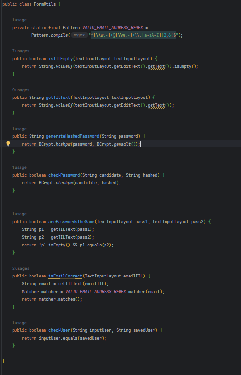
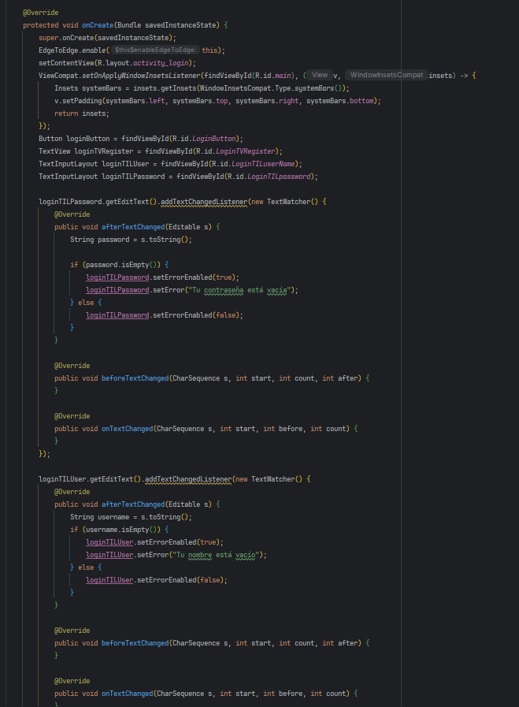
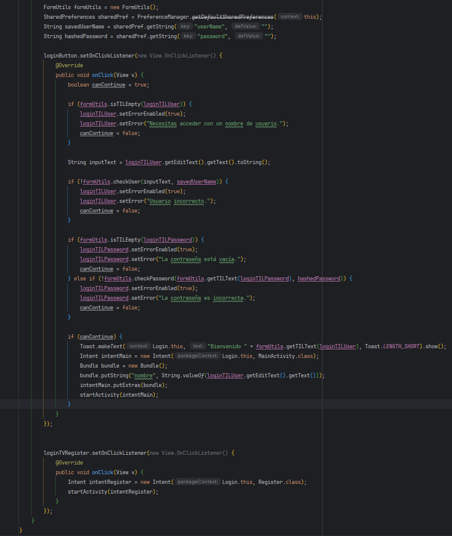

En esta clase (FormUtils) primero podemos comprobar el email con un regex, para que sea válido y no un texto cualquiera.
Después una comprobación si hay un TIL (TextInputLayour) vacío, que retorne el booleano.
Generamos una contraseña hasheada por seguridad y la comprobamos que sean las dos iguales (Register) como se ve en el Register.
Comprobacion del Email que retorne booleano.
Que compruebe si el usuario introducido es igual al usuario guardado por SharedPreferences en el Register.

Con el addTextChangedListener lo que hacemos es cada vez que se escriba compruebe por ejemplo si está vacía la contraseña, que saque un error y que cambie el booleano de este a true, 
si esta condición no se cumple, entonces el booleano de error es false.
Se hace para la contraseña y el nombre.

Después con el click del botón se comprueban errores con lo que había antes en el formUtils.
Se declara un booleano para que si entra en el error, no siga a la siguiente actividad, y si no da error (la contraseña y usuario coinciden con las guardadas, hay texto...)
entonces entra en el if (canContinue) y sacamos un Toast con una bienvenida del TIL del user, después declaramos el intent y el bundle y comenzamos la siguiente actividad, en
este caso MainActivity.
El botón de abajo es para que si no estás registrado, te mande a Register para que te crees la cuenta
